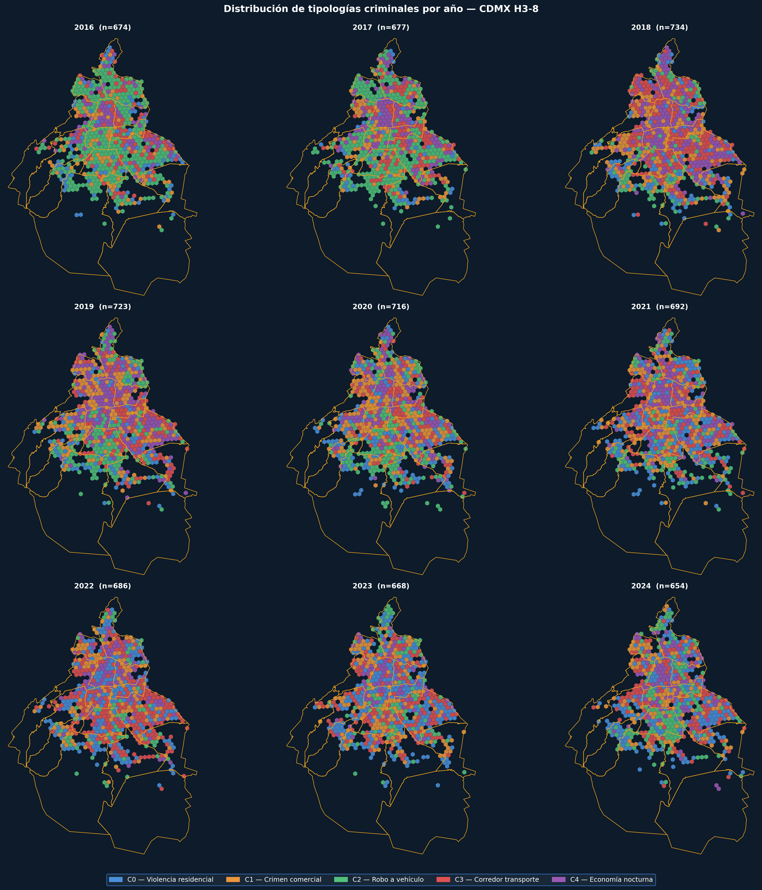
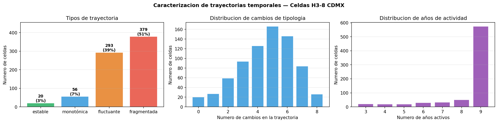
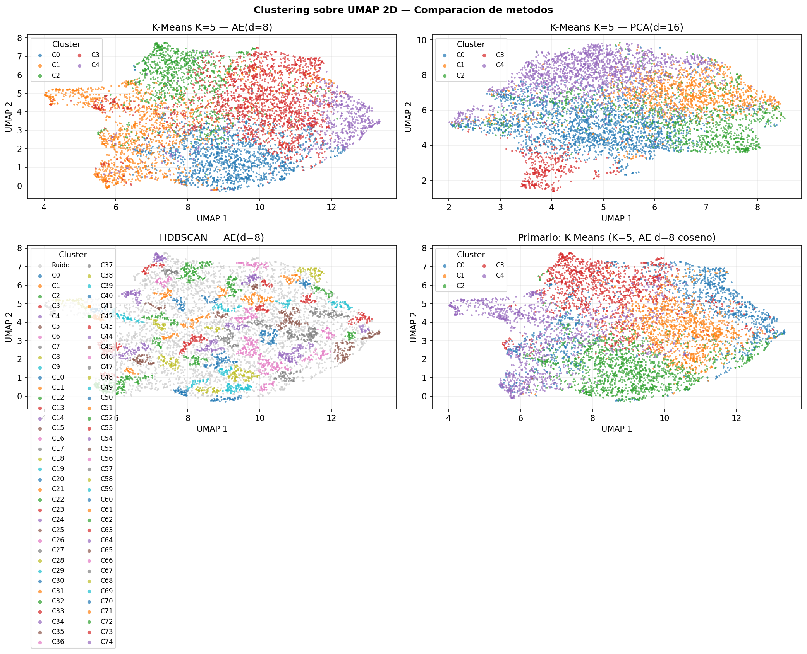

# Tracking Urban Crime Trajectories Through Dynamic Neighborhood Embeddings


Aprende representaciones dinámicas de zonas urbanas a partir de datos abiertos de crimen de la CDMX (2016–2024) y clasifica cómo evoluciona el perfil delictivo de cada zona en el tiempo — no predice crimen, modela **trayectorias de cambio**.



---

## Stack

| Capa | Tecnología |
|---|---|
| Indexación espacial | H3 resolución 8 (~460m por celda) |
| Representación | PyTorch autoencoder (22d → 8d) |
| Clustering | scikit-learn K-Means (k=5) |
| Análisis temporal | Markov chains · BOCPD · PELT · DTW |
| API | FastAPI + Pydantic v2 |
| Contenedor | Docker multi-stage, CPU-only torch |
| CI | GitHub Actions |

---

## Quickstart

**Local**
```bash
git clone https://github.com/rrramirrr/Tracking-Urban-Crime-Trajectories-Through-Dynamic-Neighborhood-Embeddings
cd Tracking-Urban-Crime-Trajectories-Through-Dynamic-Neighborhood-Embeddings/urbancrime-api
cp .env.example .env
pip install -r requirements.txt
uvicorn app.main:app --reload
```

**Docker**
```bash
cd urbancrime-api
docker compose up
```

Swagger UI disponible en `http://localhost:8000/docs`.

---

## Arquitectura

```
Raw FGJ data (534 MB)
        │
        ▼
Pipeline/ (6 notebooks)
  01 Preprocesamiento → 02 Firmas H3 → 03 Autoencoder
  → 04 Clustering → 05 Trayectorias → 06 Mapas
        │
        │  artefactos: encoder_weights.pt · *.csv
        ▼
urbancrime-api/ (FastAPI + Docker)
  GET  /cells/{h3}            perfil + tipo de trayectoria
  GET  /cells/{h3}/trajectory secuencia año a año
  GET  /clusters              5 tipologías con perfiles
  GET  /clusters/transitions  matriz de Markov
  POST /embed                 firma (22d) → embedding (8d)
```

---

## Resultados

748 celdas H3 · 9 años (2016–2024) · 5 clusters · 4 tipos de trayectoria

| Trayectoria | Celdas | Descripción |
|---|---|---|
| `fragmentada` | 379 (51%) | Cambios sin patrón claro |
| `fluctuante` | 293 (39%) | Cambia pero regresa al estado base |
| `monotónica` | 56 (7%) | Cambio sostenido en una dirección |
| `estable` | 20 (3%) | Mismo cluster en todos los años |

El cluster de mayor intensidad delictiva es el más persistente: **46.5% de probabilidad de permanecer en él al año siguiente** (diagonal dominante en la matriz de Markov).




---

## Decisiones técnicas

- **H3 sobre colonias:** celdas de tamaño uniforme eliminan el sesgo de área que introducen los polígonos administrativos irregulares
- **Autoencoder sobre PCA:** captura relaciones no lineales entre features — un barrio con crimen nocturno concentrado y otro con crimen diurno disperso tienen firmas cualitativamente distintas que una proyección lineal mezcla
- **In-memory store sobre base de datos:** 748 celdas × 9 años = 6,224 registros, <10 MB; lookups O(1) en dicts de Python sin overhead operacional
- **Data como Docker volume:** separar código de artefactos permite reentrenar el modelo sin reconstruir la imagen

---

## Estructura

```
├── Pipeline/                    # 6 notebooks de entrenamiento (ejecutar en orden)
├── data/
│   ├── models/                  # encoder_weights.pt · pca_baseline.pkl
│   ├── processed/               # CSVs del pipeline (embeddings, clusters, trayectorias)
│   └── maps/                    # Mapas interactivos Folium (.html)
├── urbancrime-api/
│   ├── app/
│   │   ├── main.py              # FastAPI app + lifespan warm-up
│   │   ├── routers/             # cells · clusters · embed
│   │   ├── schemas/             # Pydantic response models
│   │   └── services/            # DataStore singleton · EncoderService
│   ├── Dockerfile
│   └── docker-compose.yml
└── .github/workflows/
    └── api-tests.yml            # CI: 8 smoke tests en cada push
```

---

## Dataset

Fuente: [Carpetas de Investigación FGJ CDMX](https://datos.cdmx.gob.mx/dataset/carpetas-de-investigacion-fgj-de-la-ciudad-de-mexico) · ~1.8M registros · 2016–2025 · no incluido en el repo por tamaño (534 MB)
