# Tracking Urban Crime Trajectories Through Dynamic Neighborhood Embeddings


> **Urban region representation learning** aplicado a datos abiertos de crimen de la Ciudad de México (2016–2024).
> Autoencoder entrenado en PyTorch + clustering K-Means + análisis de trayectorias de Markov, servidos mediante una REST API lista para producción.

---

## Tabla de contenidos

1. [El problema](#1-el-problema)
2. [Pregunta de investigación](#2-pregunta-de-investigación)
3. [Dataset](#3-dataset)
4. [Pipeline de ML](#4-pipeline-de-ml)
5. [Resultados](#5-resultados)
6. [API de producción](#6-api-de-producción)
7. [MLOps e infraestructura](#7-mlops-e-infraestructura)
8. [Quickstart](#8-quickstart)
9. [Stack tecnológico](#9-stack-tecnológico)
10. [Estructura del repositorio](#10-estructura-del-repositorio)

---

## 1. El problema

La mayoría de análisis de crimen urbano trata los barrios como **entidades estáticas**: "esta zona tiene mucho robo", "aquella tiene poca actividad delictiva". Ese enfoque captura una fotografía, pero la ciudad es un sistema dinámico.

Los barrios cambian. Una zona que en 2016 concentraba crimen de alto impacto puede haberse transformado para 2024 — o puede haber permanecido exactamente igual. Identificar qué tipo de cambio ocurrió, cuándo, y con qué intensidad, es información que los enfoques estáticos no pueden proveer.

Este proyecto aborda esa limitación aprendiendo **representaciones temporales dinámicas** de zonas urbanas a partir del registro administrativo de la FGJ CDMX.

> La palabra *trayectoria* en este proyecto no significa ruta o camino físico, sino la **evolución del perfil delictivo** de una zona urbana a lo largo del tiempo.

---

## 2. Pregunta de investigación

> ¿Es posible aprender representaciones dinámicas de zonas urbanas robustas a categorías delictivas ruidosas, y utilizarlas para modelar trayectorias temporales que permitan identificar patrones de persistencia, transición y cambio abrupto en el crimen reportado?

**Subpreguntas:**
- ¿Qué tipos de trayectorias temporales presentan las distintas zonas de la CDMX?
- ¿Qué zonas muestran cambios de perfil más intensos, graduales o persistentes?

---

## 3. Dataset

| Atributo | Valor |
|---|---|
| Fuente | [Carpetas de Investigación FGJ CDMX](https://datos.cdmx.gob.mx/dataset/carpetas-de-investigacion-fgj-de-la-ciudad-de-mexico) |
| Periodo | Enero 2016 – Enero 2025 |
| Tamaño raw | ~534 MB (no incluido en el repo) |
| Registros originales | ~1.8 millones de carpetas de investigación |
| Unidad espacial | Celdas hexagonales H3 resolución 8 (~460m de diámetro) |
| Celdas válidas | 748 (con cobertura anual suficiente) |
| Años cubiertos | 2016, 2017, 2018, 2019, 2020, 2021, 2022, 2023, 2024 |

Los datos de la FGJ presentan **ruido inherente**: categorías delictivas inconsistentes entre años, registros duplicados, coordenadas fuera del polígono de CDMX, y sesgo de reporte. El preprocesamiento fue una parte crítica del proyecto.

---

## 4. Pipeline de ML

El pipeline completo se divide en 6 notebooks ejecutados en orden. Cada uno produce artefactos que el siguiente consume.

```
Raw FGJ data
     │
     ▼
┌─────────────────────────────────────────────────────────────┐
│  NB01 · Preprocesamiento                                    │
│  Limpieza, filtrado geográfico, armonización de categorías  │
│  Output: fgj_limpio_2016_2024.csv                           │
└────────────────────────┬────────────────────────────────────┘
                         │
                         ▼
┌─────────────────────────────────────────────────────────────┐
│  NB02 · Firmas Espacio-Temporales                           │
│  H3 resolución 8 · vectores de 22 features por celda/año   │
│  Output: firmas_h3_8_anual.csv                              │
└────────────────────────┬────────────────────────────────────┘
                         │
                         ▼
┌─────────────────────────────────────────────────────────────┐
│  NB03 · Reducción de Dimensionalidad                        │
│  Autoencoder PyTorch: 22d → 8d                              │
│  Baseline PCA para comparación                              │
│  Output: encoder_weights.pt · embeddings_ae_d8.csv          │
└────────────────────────┬────────────────────────────────────┘
                         │
                         ▼
┌─────────────────────────────────────────────────────────────┐
│  NB04 · Clustering                                          │
│  K-Means sobre embeddings (k=5) · validación bootstrap      │
│  Output: cluster_assignments.csv · cluster_profiles.csv     │
└────────────────────────┬────────────────────────────────────┘
                         │
                         ▼
┌─────────────────────────────────────────────────────────────┐
│  NB05 · Trayectorias                                        │
│  Clasificación de trayectorias · Markov · BOCPD · PELT      │
│  Output: trajectories.csv · transition_matrix.csv           │
└────────────────────────┬────────────────────────────────────┘
                         │
                         ▼
┌─────────────────────────────────────────────────────────────┐
│  NB06 · Mapas                                               │
│  Visualizaciones interactivas Folium                        │
│  Output: data/maps/*.html                                   │
└─────────────────────────────────────────────────────────────┘
```

### NB01 — Preprocesamiento

Punto de partida: ~1.8M carpetas de investigación en formato CSV crudo.

**Operaciones principales:**
- Eliminación de registros con coordenadas nulas o fuera del polígono de CDMX
- Armonización semántica de categorías delictivas (más de 80 categorías originales reducidas a 10 grupos funcionales)
- Filtrado temporal: solo registros 2016–2024 con fecha válida
- Validación de cobertura anual por celda H3

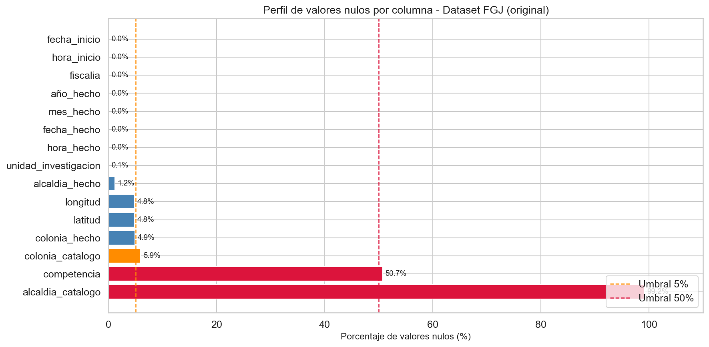
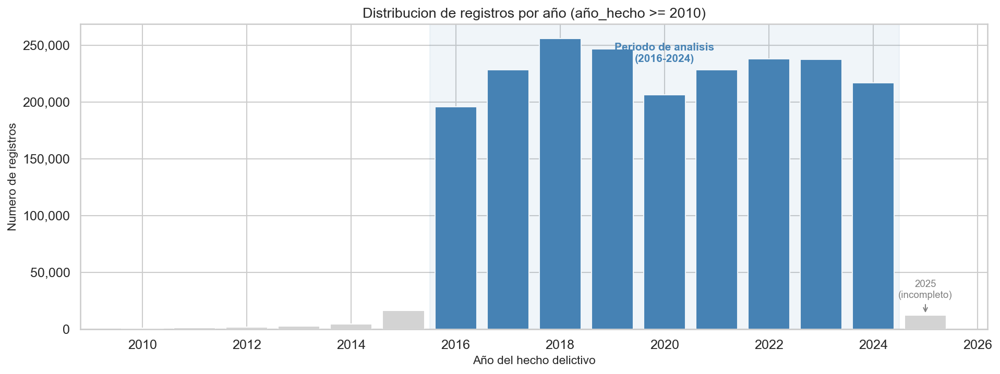
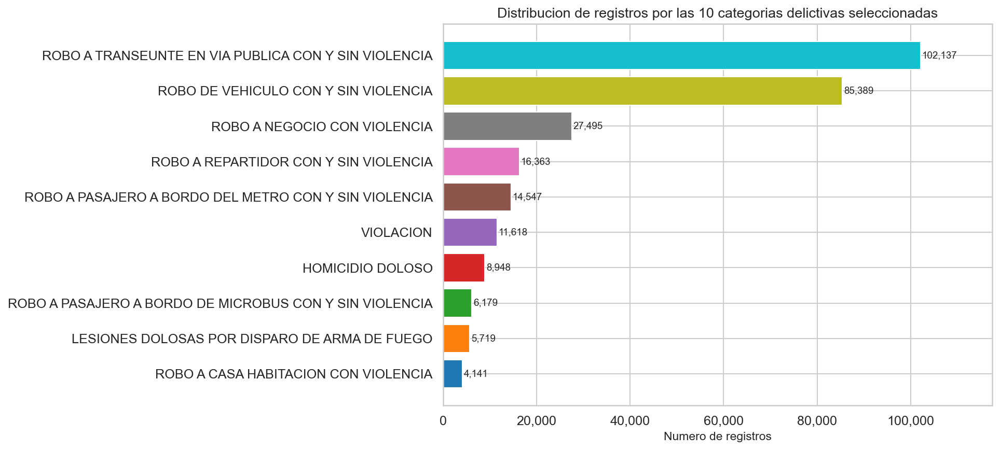

---

### NB02 — Firmas Espacio-Temporales

Cada delito se mapea a su celda H3 resolución 8. Para cada celda y cada año se construye un vector de **22 features**:

| Grupo | Features | Descripción |
|---|---|---|
| Composición delictiva | `cm_transeunte`, `cm_vehiculo`, `cm_negocio`, `cm_repartidor`, `cm_metro`, `cm_violacion`, `cm_homicidio`, `cm_microbus`, `cm_lesiones`, `cm_casa` | Proporción de cada tipo de delito |
| Patrón horario | `hr_madrugada`, `hr_manana`, `hr_tarde`, `hr_noche` | Distribución del crimen por franja horaria |
| Patrón semanal | `ds_0` … `ds_6` | Distribución por día de la semana |
| Intensidad | `log_n` | Logaritmo del número de delitos |

**¿Por qué H3 y no colonias o alcaldías?**
H3 produce celdas hexagonales de tamaño uniforme (~460m a resolución 8). Las colonias son polígonos irregulares de tamaños muy distintos — comparar tasas entre ellas introduce sesgo de área. H3 elimina ese problema.

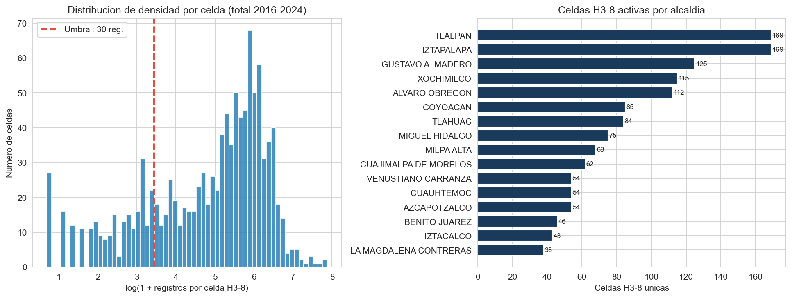
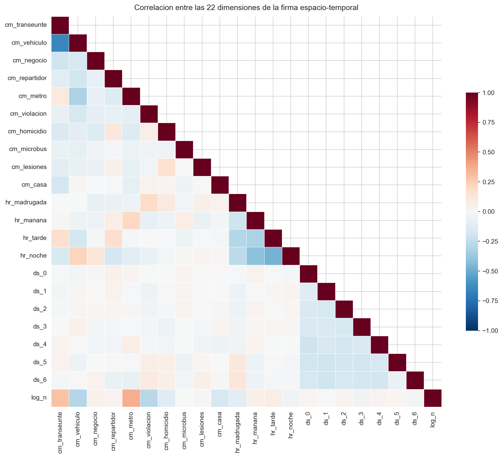

---

### NB03 — Reducción de Dimensionalidad

Con los vectores de 22 dimensiones, el objetivo es aprender una representación compacta que capture la *identidad funcional* de cada zona.

**Autoencoder entrenado:**
```
Input (22) → Linear(22→16) → BatchNorm1d(16) → ReLU → Linear(16→8) → Embedding (8d)
```

**¿Por qué autoencoder y no solo PCA?**
PCA asume que las relaciones entre features son lineales. Un barrio con crimen nocturno concentrado y otro con crimen diurno disperso tienen perfiles cualitativamente distintos que una proyección lineal puede mezclar. El autoencoder aprende fronteras no lineales.

Se entrenó también un PCA como baseline para comparación.

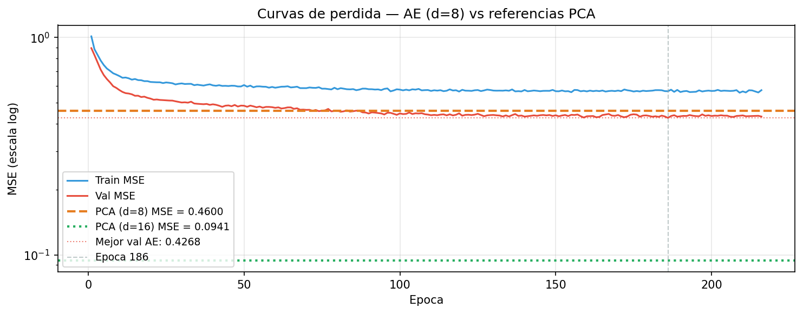
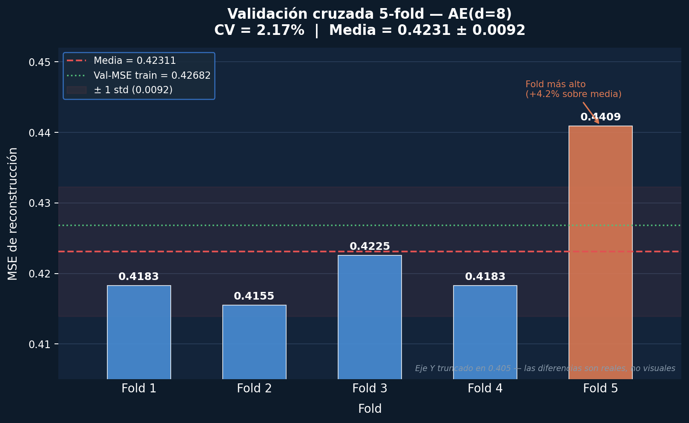
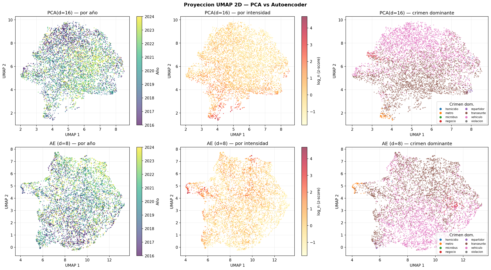
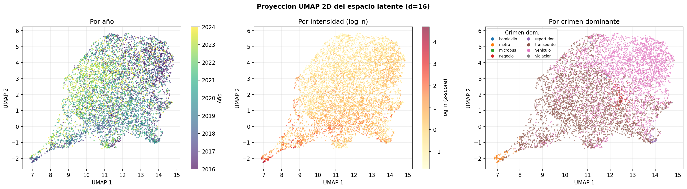

---

### NB04 — Clustering

Con los embeddings de 8 dimensiones se identifican **5 tipologías de zona urbana** usando K-Means.

**Selección de k:**
Se evaluaron k=2 a k=8 usando silhouette score, índice Davies-Bouldin y estabilidad bootstrap. k=5 ofrece el mejor balance entre coherencia interna y separabilidad.

**Perfiles de los 5 clusters:**

| Cluster | Crimen dominante | Intensidad (`log_n`) | Característica |
|---|---|---|---|
| 0 | Transeúnte (36%) + Vehículo (29%) | 3.33 | Zonas mixtas, baja intensidad |
| 1 | Transeúnte (33%) + Vehículo (31%) | 3.57 | Zonas comerciales medias |
| 2 | Vehículo (53%) + Transeúnte (21%) | 3.36 | Alta concentración de robo vehicular |
| 3 | Transeúnte (41%) + Vehículo (29%) | 3.64 | Zonas peatonales de alto tránsito |
| 4 | Transeúnte (37%) + Vehículo (26%) | 3.96 | Mayor intensidad absoluta |

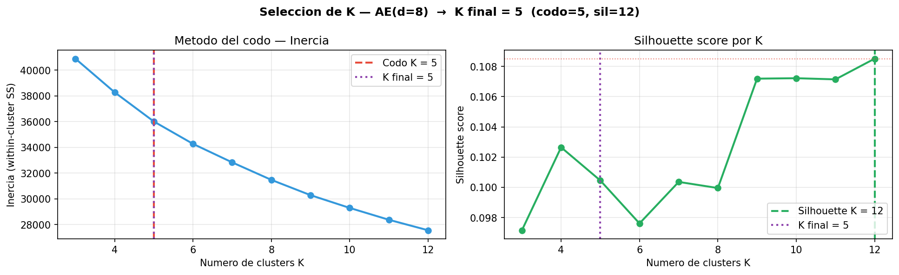
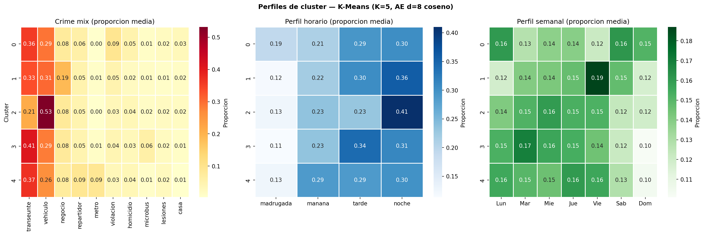


---

### NB05 — Trayectorias

Para cada celda se observa su **secuencia de clusters año a año** (ej: `2,2,2,2,2,0,2,2,2`) y se clasifica en uno de 4 tipos de trayectoria.

**Clasificación de trayectorias:**

| Tipo | Descripción | Ejemplo de secuencia |
|---|---|---|
| `estable` | Mismo cluster en todos los años observados | `2,2,2,2,2,2,2,2,2` |
| `fluctuante` | Cambia pero regresa al estado original | `2,2,0,2,2,2,0,2,2` |
| `monotónica` | Cambio sostenido en una sola dirección | `0,0,1,1,2,2,3,3,4` |
| `fragmentada` | Cambios sin patrón claro identificable | `0,3,1,4,2,0,3,1,2` |

**Matriz de transición de Markov:**
Dado que una celda está en el cluster X este año, ¿con qué probabilidad estará en el cluster Y el siguiente?

| Cluster | Se queda (probabilidad) |
|---|---|
| 0 | 35.0% |
| 1 | 32.8% |
| 2 | 38.2% |
| 3 | 34.3% |
| **4** | **46.5%** (más estable) |

**Detección de puntos de cambio:**
Se aplicaron BOCPD (Bayesian Online Changepoint Detection) y PELT para identificar años en que el perfil de una celda cambió abruptamente.


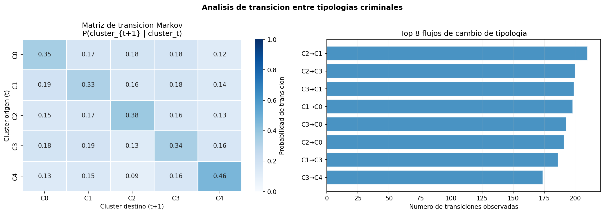
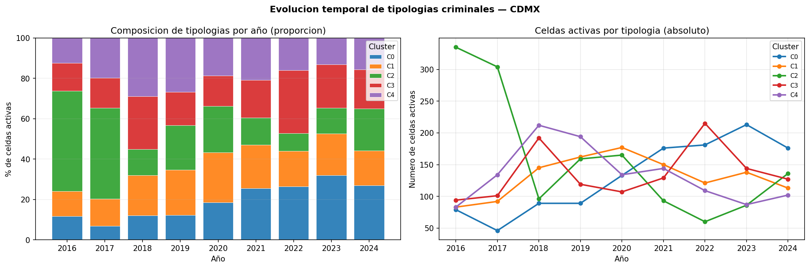
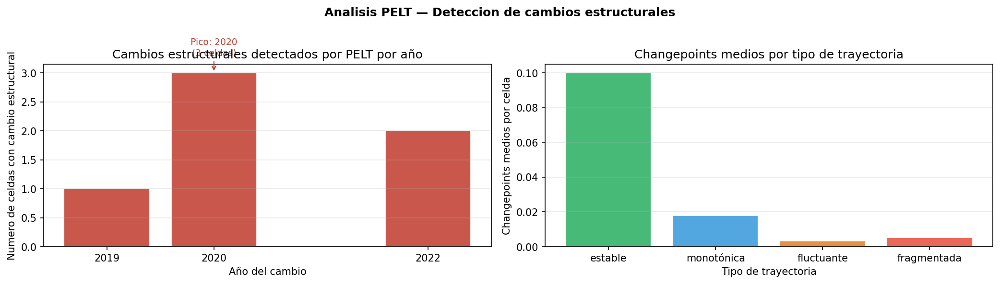
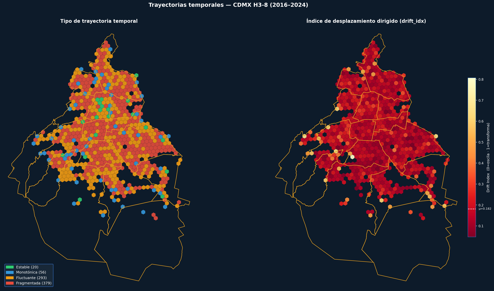

---

### NB06 — Mapas

Visualizaciones interactivas generadas con Folium, disponibles en `data/maps/`:

| Mapa | Descripción |
|---|---|
| `mapa_tipologias_anual.html` | Tipología de cluster por celda, año a año |
| `mapa_animado_tipologias.html` | Animación 2016–2024 de tipologías |
| `mapa_animado_trayectorias.html` | Animación de trayectorias de evolución |
| `mapa_trayectorias.html` | Tipo de trayectoria por celda |
| `mapa_comparacion_2016_2024.html` | Cambio entre primer y último año observado |
| `mapa_changepoints.html` | Localización de puntos de cambio abrupto |
| `mapa_intensidad_heatmap.html` | Heatmap de intensidad delictiva |
| `mapa_lisa.html` | Análisis de autocorrelación espacial (LISA) |
| `mapa_desplazamiento.html` | Desplazamiento en espacio latente por celda |

---

## 5. Resultados

**748 celdas H3** analizadas a lo largo de **9 años** (2016–2024).

**Distribución de trayectorias:**

| Tipo | Celdas | Porcentaje |
|---|---|---|
| `fragmentada` | 379 | 50.7% |
| `fluctuante` | 293 | 39.2% |
| `monotónica` | 56 | 7.5% |
| `estable` | 20 | 2.7% |

**Hallazgos principales:**
- El 93% de las celdas muestra algún tipo de variación en su perfil delictivo entre 2016 y 2024 — solo el 2.7% se mantiene completamente estable
- El cluster 4 (mayor intensidad delictiva) es el más "pegajoso": una vez que una zona entra, tiene 46.5% de probabilidad de permanecer en él al año siguiente
- El análisis de Moran's I confirma autocorrelación espacial significativa — zonas con crimen similar tienden a ser vecinas

---

## 6. API de producción

Todos los resultados del pipeline son accesibles mediante una REST API construida con FastAPI.

### Endpoints

| Método | Ruta | Descripción |
|---|---|---|
| `GET` | `/health` | Estado del servidor + tamaño del dataset |
| `GET` | `/cells/{h3_index}` | Resumen de celda: estabilidad, cluster modal, tipo de trayectoria |
| `GET` | `/cells/{h3_index}/trajectory` | Secuencia completa año a año con asignación de cluster |
| `GET` | `/clusters` | Los 5 perfiles de cluster con composición delictiva y patrones temporales |
| `GET` | `/clusters/{id}` | Detalle de un cluster + lista de celdas miembro |
| `GET` | `/clusters/transitions` | Matriz de transición de Markov entre clusters |
| `GET` | `/predictions` | Predicciones de cluster para 2024 |
| `POST` | `/embed` | Firma de crimen (22 features) → embedding latente de 8 dimensiones |

### Ejemplos

```bash
# Estado del servidor
curl http://localhost:8000/health

# Perfil de una celda específica
curl http://localhost:8000/cells/88499516d9fffff

# Historial año a año de una celda
curl http://localhost:8000/cells/88499516d9fffff/trajectory

# Generar embedding desde una firma nueva (inferencia en vivo)
curl -X POST http://localhost:8000/embed \
  -H "Content-Type: application/json" \
  -d '{"features": [0.33, 0.29, 0.12, 0.05, 0.01, 0.07, 0.03, 0.01, 0.02, 0.04,
                    0.19, 0.22, 0.31, 0.28, 0.14, 0.13, 0.14, 0.14, 0.13, 0.15, 0.14, 3.5]}'
```

La documentación interactiva (Swagger UI) está disponible en `http://localhost:8000/docs` al levantar el servidor.

### Decisiones de diseño

**¿Por qué in-memory store y no base de datos?**
748 celdas × 9 años = 6,224 registros, menos de 10 MB total. Cargando los CSVs en dicts de Python al startup se obtienen lookups O(1) por request, sin latencia de red ni overhead operacional. Una base de datos añadiría complejidad sin ningún beneficio a esta escala.

**¿Por qué FastAPI y no Flask?**
FastAPI genera documentación OpenAPI automáticamente (Swagger UI), valida tipos de entrada y salida con Pydantic, y tiene soporte nativo de async. Flask requiere librerías externas para todo eso.

**¿Por qué singleton con `lru_cache`?**
`DataStore` (carga 6 CSVs) y `EncoderService` (carga pesos PyTorch) son costosos de inicializar. `@lru_cache(maxsize=1)` garantiza que se crean exactamente una vez al arrancar el servidor — no en cada request.

---

## 7. MLOps e infraestructura

### Docker

La API está empaquetada en un contenedor Docker con **multi-stage build**:

- **Stage builder:** instala dependencias (proceso sucio, genera caché de pip)
- **Stage runtime:** copia solo los paquetes ya instalados, sin caché → imagen ~30% más liviana
- **CPU-only torch:** ahorra ~600 MB frente a la wheel con soporte CUDA (el encoder tiene solo 480 parámetros — una CPU lo corre en microsegundos)
- **Data montada como volume:** los modelos y CSVs se montan en `/data` al runtime, no se hornean en la imagen. Reentrenar el modelo no requiere reconstruir la imagen

```bash
cd urbancrime-api
docker compose up
# La API queda disponible en http://localhost:8000
```

### GitHub Actions — CI automático

Cada push que toca `urbancrime-api/` dispara un workflow que:

1. Levanta una máquina Ubuntu limpia
2. Instala Python 3.9 y todas las dependencias (con caché de pip)
3. Corre 8 assertions contra la API usando `TestClient` de FastAPI

```
✅ /health           — 748 celdas, 5 clusters
✅ /cells/{h3}       — tipo de trayectoria válido
✅ /cells/trajectory  — registros anuales presentes
✅ /clusters         — exactamente 5 clusters
✅ /clusters/{id}    — cluster tiene celdas asignadas
✅ /transitions      — diagonal de Markov dominante
✅ /embed            — embedding de 8 dimensiones
✅ 404               — celda inexistente → error controlado
```

**Por qué quedaron 3 runs en el historial (2 fallidos, 1 exitoso):**

El historial completo se preserva intencionalmente. Los fallos exponen el proceso real de debug:
- **Run #1** — `--no-deps` aplicado incorrectamente a todos los paquetes: FastAPI se instalaba sin sus dependencias transitivas (`starlette`, `anyio`)
- **Run #2** — `scaler_firmas.pkl` requiere `scikit-learn` en runtime para deserializar el `StandardScaler`, no estaba declarado en `requirements.txt`
- **Run #3** — verde ✅

Ambos errores son patrones clásicos de MLOps que no aparecen en el desarrollo local (donde el entorno ya tiene todo instalado) pero sí en un entorno limpio de CI.

### Separación pipeline / serving

```
Pipeline/ (entrenamiento — Jupyter, experimental)
    │
    │  artifacts
    ▼
data/models/encoder_weights.pt     ← pesos del encoder
data/processed/*.csv               ← resultados precomputados
    │
    │  mount
    ▼
urbancrime-api/ (serving — FastAPI, producción)
```

El código de entrenamiento y el de serving nunca se mezclan. El único puente son los artefactos. Esto permite actualizar el modelo sin tocar la API, y viceversa.

---

## 8. Quickstart

### Opción A — Local

```bash
git clone https://github.com/rrramirrr/Tracking-Urban-Crime-Trajectories-Through-Dynamic-Neighborhood-Embeddings
cd Tracking-Urban-Crime-Trajectories-Through-Dynamic-Neighborhood-Embeddings/urbancrime-api

cp .env.example .env          # configura paths a data/

pip install -r requirements.txt
uvicorn app.main:app --reload
```

Abre `http://localhost:8000/docs` para la interfaz Swagger interactiva.

### Opción B — Docker

```bash
cd urbancrime-api
docker compose up
```

El `docker-compose.yml` monta `../data` como volumen de solo lectura dentro del contenedor.

### Reproducir el pipeline completo

Requiere el dataset raw de la FGJ (disponible en el link de la sección Dataset). Ejecutar los notebooks en orden dentro de `Pipeline/`:

```
01_Preprocesamiento.ipynb
02_Firmas_Espacio_Temporales.ipynb
03_Reduccion_Dimensionalidad.ipynb
04_Clustering.ipynb
05_Trayectorias.ipynb
06_Mapas.ipynb
```

---

## 9. Stack tecnológico

| Capa | Tecnología |
|---|---|
| Indexación espacial | H3 (Uber) resolución 8 |
| Representación | PyTorch autoencoder |
| Clustering | scikit-learn K-Means |
| Análisis temporal | Markov chains, DTW, BOCPD, PELT |
| Autocorrelación espacial | PySAL (Moran's I, LISA) |
| API | FastAPI + Pydantic v2 + uvicorn |
| Contenedor | Docker multi-stage, CPU-only torch |
| CI | GitHub Actions |
| Visualización | Folium, Matplotlib, Seaborn |
| Datos | FGJ CDMX open data (2016–2024) |

---

## 10. Estructura del repositorio

```
├── Pipeline/                         # Notebooks de entrenamiento (ejecutar en orden)
│   ├── 01_Preprocesamiento.ipynb
│   ├── 02_Firmas_Espacio_Temporales.ipynb
│   ├── 03_Reduccion_Dimensionalidad.ipynb
│   ├── 04_Clustering.ipynb
│   ├── 05_Trayectorias.ipynb
│   └── 06_Mapas.ipynb
│
├── data/
│   ├── models/                       # Artefactos entrenados
│   │   ├── encoder_weights.pt        # Encoder del autoencoder (PyTorch)
│   │   ├── autoencoder_weights.pt    # Autoencoder completo
│   │   └── pca_baseline.pkl          # Baseline PCA
│   ├── processed/                    # Outputs del pipeline
│   │   ├── firmas_h3_8_anual.csv     # Firmas espacio-temporales (22 features)
│   │   ├── embeddings_ae_d8.csv      # Embeddings del autoencoder (8d)
│   │   ├── cluster_assignments.csv   # Cluster por celda y año
│   │   ├── cluster_profiles.csv      # Perfil de cada cluster
│   │   ├── trajectories.csv          # Tipo de trayectoria por celda
│   │   ├── transition_matrix.csv     # Matriz de Markov
│   │   ├── predictions_2024.csv      # Predicciones cluster 2024
│   │   └── scaler_firmas.pkl         # StandardScaler del pipeline
│   ├── maps/                         # Mapas interactivos HTML (Folium)
│   └── figures/                      # Figuras de resultados
│
├── figures/                          # Figuras de preprocesamiento
│
├── urbancrime-api/                   # API REST de producción
│   ├── app/
│   │   ├── main.py                   # FastAPI app + lifespan
│   │   ├── config.py                 # Settings via pydantic-settings
│   │   ├── dependencies.py           # Singletons con lru_cache
│   │   ├── routers/                  # Endpoints por dominio
│   │   │   ├── cells.py
│   │   │   ├── clusters.py
│   │   │   └── embed.py
│   │   ├── schemas/                  # Pydantic response models
│   │   │   ├── cell.py
│   │   │   ├── cluster.py
│   │   │   └── embed.py
│   │   └── services/                 # Lógica de negocio
│   │       ├── data_store.py         # Carga CSVs en memoria al startup
│   │       └── encoder.py            # Inferencia con encoder PyTorch
│   ├── Dockerfile                    # Multi-stage build, CPU-only torch
│   ├── docker-compose.yml            # Monta ../data como volumen
│   ├── requirements.txt
│   └── .env.example
│
├── .github/
│   └── workflows/
│       └── api-tests.yml             # CI: smoke tests en cada push
│
└── limite-de-las-alcaldas.json       # Polígonos de alcaldías CDMX (GeoJSON)
```

---

## Contexto de investigación

Este proyecto se posiciona en la intersección de tres líneas:

- **Label noise en datos administrativos** — las categorías delictivas de la FGJ son ruidosas e inconsistentes entre años; la robustez del preprocesamiento es tan importante como el modelo
- **Urban region representation learning** — aprender embeddings que capturen la identidad funcional de zonas urbanas, no solo su descripción estadística puntual
- **Análisis de dinámicas temporales** — modelar cómo esas identidades evolucionan, persisten o cambian abruptamente

La metodología es transferible a cualquier ciudad latinoamericana con datos administrativos de crimen de estructura similar.
